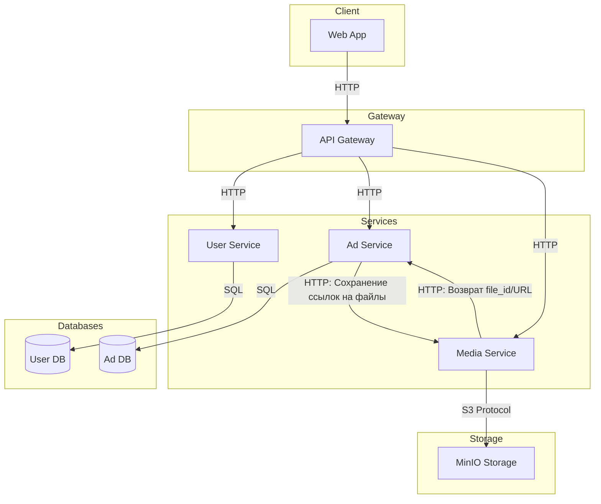
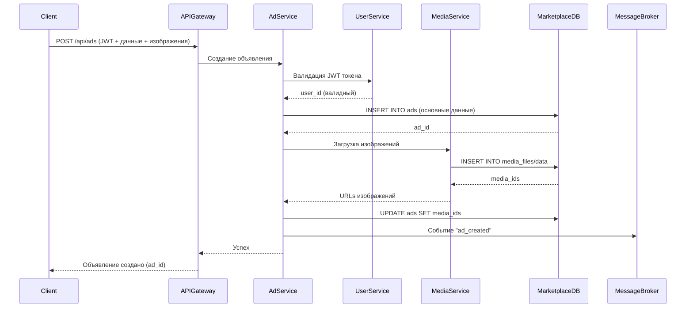
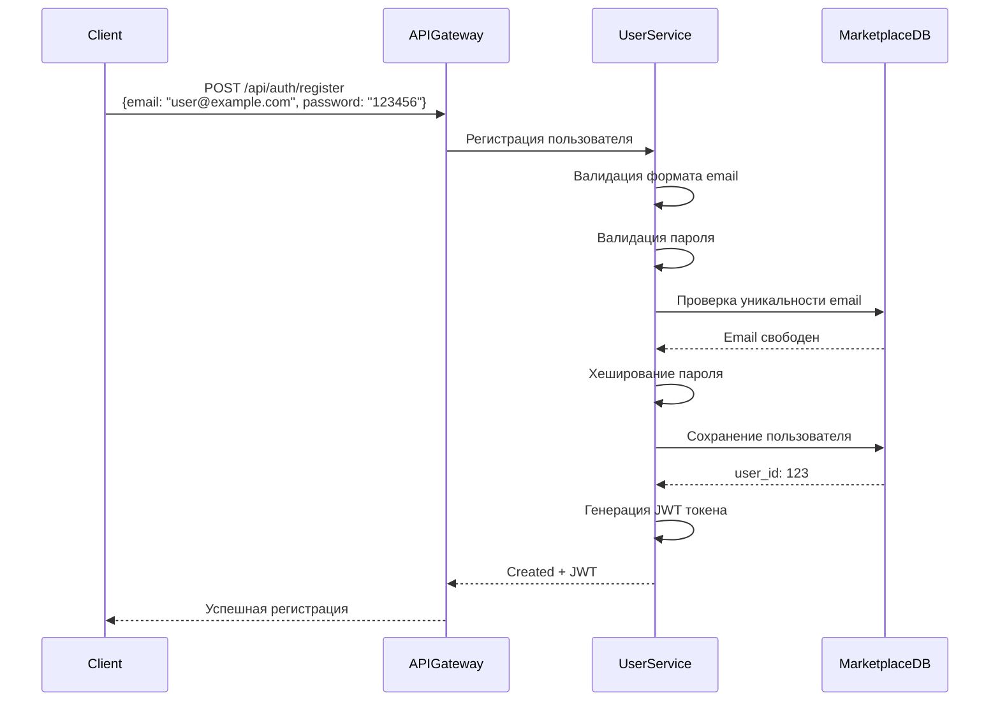
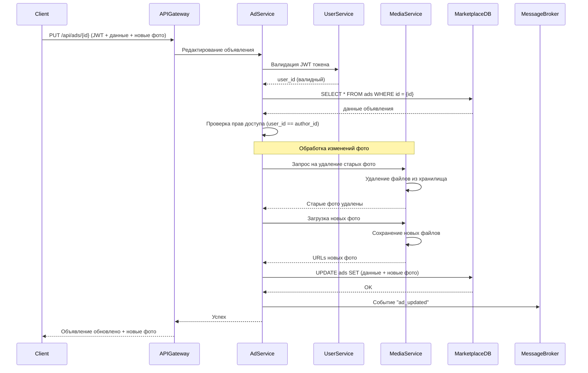
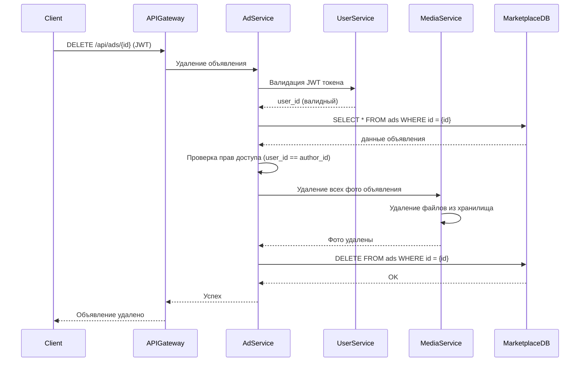
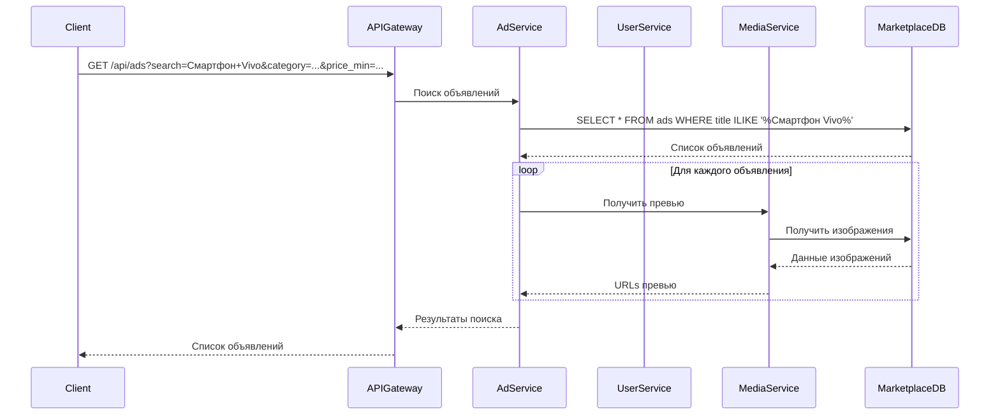

  
  

�

# Техническое решение проекта «Moonshine»

  

  

## Введение

  

  

-  **Цель проекта:**

  

  

Разработка интернет-магазина с объявлениями, где каждый пользователь может размещать свои объявления о продаже, просматривать объявления других пользователей и взаимодействовать с платформой через веб-интерфейс.

  

-  **Задачи**

  

1. Разработать систему регистрации и авторизации пользователей.

  

2. Создать функционал по созданию, редактированию, удалению объявлений.

  

3. Обеспечить пользователям возможность просмотра а также поиска объявлений с фильтрацией по категориям и цене.

  

4. Построить распределённую архитектуру для обеспечения отказоустойчивости и масштабируемости системы.

  

5. Обеспечить приемлемую производительность системы.

  

  

-  **Основания для разработки:**

  

1. Желание участников команды получить опыт в разработке распределённой системы.

  

2. Учебный проект по курсу "Распределённые системы".

  

  

-  **Команда:**

  

  

| Участник | Роль |

|-------------|-------------|

| Васильев Ян | Backend - разработчик |

| Телицин Андрей | Team Lead Backend - разработчик |

| Хисяметдинов Марат | Backend-разработчик Frontend - разработчик |

| Христич Глория | Frontend - разработчик Backend - разработчик |

  
  

---

  

  

  

## Глоссарий

  

| Термин | Определение |

|--------|-------------|

| **Пользователь** | Лицо, зарегистрированное в системе. Может выступать в роли покупателя и/или продавца. |

| **Продавец** | Пользователь, который разместил товар для продажи. |

| **Покупатель** | Пользователь, который осуществляет поиск, выбор и покупку товаров в магазине. |

| **Товар (лот)** | Единица продукта или услуги, размещенная продавцом для продажи. Содержит описание, цену, фотографии и другие характеристики. |

| **Публикация товара** | Процесс размещения продавцом информации о новом товаре в каталоге магазина. |

| **Объявление** | Опубликованный товар (лот). |

| **Каталог** | Структурированный перечень всех товаров, доступных для просмотра. |

| **Личный кабинет** | Персональный раздел системы, где пользователь управляет объявлениями, заказами, персональными данными. |

| **Избранное** | Список товаров, отмеченных пользователем для сохранения и быстрого доступа в будущем. |

  

  

  

---

  

  

  

## Функциональные требования

  

  

**Система должна предоставлять следующие функции:**

  

1. Регистрация пользователей с подтверждением через электронную почту. Двухфакторная авторизация с отправкой кода на email.

  

2. Создание и редактирование объявлений. Возможность удаления объявления. Объявление содержит описание товара, его характеристики, фото, стоимость, контактную информацию продавца.

  

3. Просмотр списка объявлений по параметрам фильтрации:
- По категории (выбор из предопределенного списка)
- По цене (диапазон от/до в рублях)
- Состояние товара
- Рейтинг продавца

4. Просмотр конкретного объявления с отображением описания товара и его фото.

  

5. Возможность зайти в профиль продавца и посмотреть его предыдущие объявления и отзывы покупателей. Возможность написать свой отзыв.

  

6. Личный кабинет с историей объявлений пользователя. Возможность изменения описания профиля.

  

  

---

  

  

  

## Нефункциональные требования

  

  

**Система должна удовлетворять следующим нефункциональным требованиям:**

  

1. Масштабируемость (разделение логических компонентов системы на независимые сервисы).

  

2. Отказоустойчивость (система продолжает работу при отказе одного из компонентов).

  

3. Приемлемое время отклика на запросы (<500 мс для основных операций).

  

4. Безопасность данных (хранение паролей в виде хешей, двухфакторная аутентификация)

  

---

  

  

  

## Пользовательские сценарии

  

### Сценарий: регистрация нового пользователя

1.  Пользователь вводит email и пароль в форме регистрации.
    
2.  Система отправляет код подтверждения на указанный email.
    
3.  Пользователь вводит полученный код подтверждения.
    
4.  При совпадении введенного кода с отправленным система создает новый аккаунт.
    
5.  Пользователь получает доступ к личному кабинету.
    

### Сценарий: создание объявления о продаже

1.  Пользователь заполняет форму создания объявления с описанием товара, ценой и категорией.
    
2.  Пользователь загружает изображения товара.
    
3.  Система проверяет данные и сохраняет объявление.
    
4.  Объявление становится доступным для просмотра другими пользователями.
    
5.  Пользователь видит свое объявление в списке активных объявлений.

### Сценарий: редактирование объявления

1. Пользователь открывает свое объявление для редактирования и вносит в него изменения.

2.  Пользователь нажимает кнопку "Сохранить изменения

3.  Система обновляет состояние объявления и отображает пользователю новое состояние.

### Сценарий: удаление объявления

1.  Пользователь выбирает свое объявление в личном кабинете.
    
2.  Пользователь нажимает кнопку удаления объявления.
    
3.  Система удаляет объявление из базы данных.
    
4.  Объявление больше не отображается в поиске и каталоге.
    
5.  Пользователь видит подтверждение успешного удаления.
    

### Сценарий: поиск объявлений

1.  Пользователь вводит поисковый запрос или выбирает фильтры (цена, категория, местоположение).
    
2.  Система выполняет поиск по базе объявлений.
    
3.  Система возвращает список подходящих объявлений.
    
4.  Пользователь просматривает результаты поиска.
    
5.  Пользователь может выбрать объявление для просмотра детальной информации.

---

## Архитектура системы

1. **API Gateway** — единая входная точка в систему, отвечает за маршрутизацию клиентских запросов к соответствующим сервисам.

2. **User Service** — сервис управления пользователями, аутентификацией, профилями и JWT-токенами. Имеет собственную базу данных.

3. **Ad Service** — основной сервис, отвечающий за создание, редактирование, управление и поиск объявлений. Работает со своей выделенной базой данных.

4. **Media Service** — сервис управления медиафайлами (изображениями товаров), включая загрузку, хранение и обработку файлов. Использует объектное хранилище MinIO.

5. **User DB** — выделенная база данных для User Service, хранит данные пользователей, настройки профилей.

6. **Ad DB** — специализированная база данных для Ad Service, содержит объявления и все их описание.

7. **MinIO Storage** — объектное хранилище для медиафайлов, обеспечивает масштабируемое и надежное хранение файлов.

---

  

  

  

## Технические сценарии

### Сценарий: создание объявления с изображениями

  

1. Клиент отправляет в API Gateway запрос POST /api/ads с данными объявления и изображениями

2. API Gateway перенаправляет запрос в сервис Ad Service

3. Ad Service валидирует JWT токен через User Service

4. Ad Service сохраняет основную информацию об объявлении в базу данных

5. Ad Service отправляет изображения в Media Service для обработки и сохранения

6. Media Service сохраняет изображения и возвращает ссылки

7. Ad Service обновляет объявление с ссылками на изображения

8. Ad Service публикует событие о создании нового объявления

9. Пользователь получает подтверждение о успешном создании объявления

---

### Сценарий: регистрация нового пользователя

  

1. Клиент отправляет в API Gateway запрос POST /api/auth/register с email и паролем

2. API Gateway перенаправляет запрос в User Service

3. User Service проверяет уникальность email

4. User Service хеширует пароль и сохраняет пользователя в базу данных

5. User Service генерирует JWT токен

6. Пользователь получает токен для последующей аутентификации

---

### Сценарий: редактирование объявления

1. Клиент отправляет в API Gateway запрос PUT /api/ads/{id} с JWT токеном и обновленными данными объявления

2. API Gateway перенаправляет запрос в сервис Ad Service

3. Ad Service валидирует JWT токен через User Service

4. Ad Service проверяет права доступа к объявлению

5. Ad Service валидирует обновленные данные

6. Ad Service обрабатывает изменения фотографий через Media Service

7. Media Service выполняет операции с файлами

8. Ad Service обновляет информацию об объявлении в базе данных

9. Ad Service публикует событие о редактировании объявления

10. Ad Service возвращает обновленные данные объявления

11. Пользователь получает подтверждение об успешном обновлении и видит новое состояние объявления

---
### Сценарий: удаление объявления
1. Клиент отправляет в API Gateway запрос DELETE /api/ads/{id} с JWT токеном
    
2. API Gateway перенаправляет запрос в сервис Ad Service
    
3. Ad Service валидирует JWT токен через User Service
    
4. Ad Service проверяет существование объявления и получает данные о нем из базы данных
    
5. Ad Service проверяет права доступа к объявлению (сравнивает user_id из токена с author_id объявления)
    
6. Ad Service отправляет запрос в Media Service на удаление всех фотографий объявления

7. Media Service удаляет файлы изображений из хранилища
    
8. Ad Service удаляет запись об объявлении из базы данных
    
9. Ad Service возвращает подтверждение об успешном удалении через API Gateway
    
10. Пользователь получает подтверждение об успешном удалении и видит обновленный список объявлений

---
### Сценарий: поиск объявления

1. Клиент отправляет в API Gateway запрос GET /api/ads с параметрами поиска и фильтрами

2. API Gateway перенаправляет запрос в сервис Ad Service

3. Ad Service проверяет кэш по ключу запроса

4. Ad Service формирует SQL запрос с WHERE условиями на основе фильтров

5. Ad Service направляет запрос в Media Service для получения превью изображения

6. Выполняется запрос к базе данных

7. Ad Service возвращает результаты поиска

8. Пользователь просматривает результаты поиска

---

  

  

  

## План разработки и тестирования

  

### Основной проект (MVP)

**Требования для выполения MVP:**

- Реализация сервиса управления пользователями (User Service, аутентификация, регистрация)

- Реализация сервиса объявлений (Ad Service) для создания, поиска и управления объявлениями

- Реализация медиа сервиса (Media Service) для загрузки и хранения изображений

- Интеграция с PostgreSQL для хранения пользователей и объявлений

- Интерграция с MiniIO для хранения медиа

- Реализация API Gateway для маршрутизации и управления запросами

- Базовый фронтенд для взаимодействия с пользователем

  

План разработки:

1. Проектирование API для пользователей, объявлений и медиа

2. Реализация API Gateway с маршрутизацией

3. Реализация User Service (регистрация, аутентификация, взаимодействие с API)

4. Реализация Ad Service (CRUD объявлений, поиск, фильтрация)

5. Реализация Media Service (загрузка, хранение изображений)

6. Настройка PostgreSQL и создание схемы базы данных

7. Настройка MiniIO Storage

8. Интеграция всех сервисов с базой данных

9. Разработка фронтенда (регистрация, создание объявлений, поиск)

10. Разработка документации API

  

План тестирования:

- Модульные тесты для логики пользователей (User Service)

- Модульные тесты для логики объявлений (Ad Service)

- Модульные тесты для обработки медиа (Media Service)

- Интеграционные тесты взаимодействия сервисов с PostgreSQL

- Тесты API Gateway (валидные/невалидные запросы, маршрутизация)

- Тесты на корректность поиска и фильтрации объявлений

- Проверка случаев внесения некорректных данных (дублирование email, невалидные изображения, недостаточные права)

  

Definition of Done (DoD) для MVP:

- Все сервисы реализованы и интегрированы

- Пользователи могут регистрироваться и аутентифицироваться

- Пользователи могут создавать, редактировать и просматривать объявления

- Поддерживается загрузка изображений к объявлениям

- Реализован поиск и фильтрация объявлений

- Все компоненты покрыты тестами

- Фронтенд обеспечивает базовое взаимодействие

  

### Расширенный проект (Advanced Scope)

Включает:

- Реализация системы уведомлений между пользователями

- Добавление чата между покупателями и продавцами

- Внедрение брокера сообщений для асинхронной обработки событий

- Реализация системы рейтингов и отзывов

- Усовершенствование алгоритмов поиска

- Улучшение отказоустойчивости

  

План разработки:

1. Реализация системы уведомлений (Notification Service)

2. Реализация чата между пользователями (Chat Service)

3. Интеграция брокера сообщений (RabbitMQ/Kafka) для событий

4. Реализация системы рейтингов и отзывов (Rating Service)

5. Добавление функционала продвижения объявлений

7. Настройка репликации PostgreSQL и балансировки нагрузки

8. Реализация кэширования (Redis) для повышения производительности

  

План тестирования:

- Тесты системы уведомлений и чата

- Тесты асинхронной обработки событий через брокер сообщений

- Тесты системы рейтингов и отзывов

- Тесты поисковой системы

- Тесты на отказоустойчивость (имитация сбоев сервисов)

- Нагрузочное тестирование системы

- Тесты кэширования и производительности

  

Definition of Done (DoD) для расширенного проекта:

- Реализована система уведомлений и чат

- Работает система рейтингов и отзывов

- Реализован полнотекстовый поиск

- Система масштабируется и отказоустойчива

- Все новые компоненты покрыты тестами

- Обеспечена высокая производительность при нагрузке