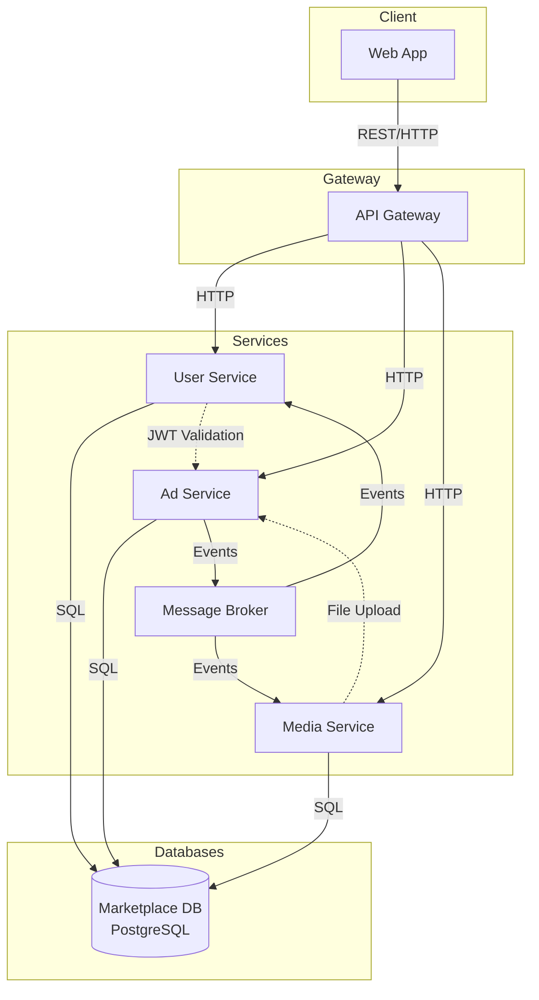
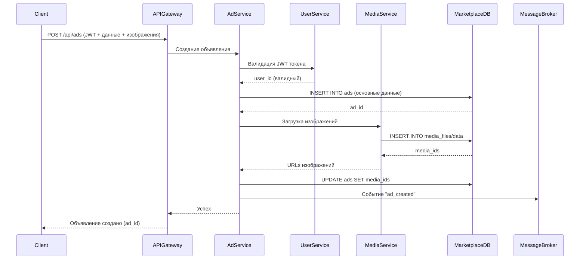


# Техническое решение проекта «Moonshine»

  
  
  

## Введение

  

-  **Цель проекта:**

  

Разработка интернет-магазина с объявлениями, где каждый пользователь может размещать свои объявления о продаже, просматривать объявления других пользователей и взаимодействовать с платформой через веб-интерфейс.

-  **Задачи**

1. Разработать систему регистрации и авторизации пользователей.

2. Создать функционал по созданию, редактированию, удалению объявлений.

3. Обеспечить пользователям возможность просмотра а также поиска объявлений с фильтрацией по категориям и цене.

4. Построить распределённую архитектуру для обеспечения отказоустойчивости и масштабируемости системы.

5. Обеспечить приемлемую производительность системы.

  

-  **Основания для разработки:**

1. Желание участников команды получить опыт в разработке распределённой системы.

2. Учебный проект по курсу "Распределённые системы".

  
  

-  **Команда:**

  
 

| Участник | Роль |
|-------------|-------------|
| Васильев Ян    | Backend - разработчик  |
| Телицин Андрей | Team Lead<br>Backend - разработчик |
| Хисяметдинов Марат | Backend-разработчик<br>Frontend - разработчик |
| Христич Глория | Frontend - разработчик<br>Backend - разработчик |


---

  

  

## Глоссарий

  | Термин | Определение |
|--------|-------------|
| **Пользователь** | Лицо, зарегистрированное в системе. Может выступать в роли покупателя и/или продавца. |
| **Продавец** | Пользователь, который разместил товар для продажи. |
| **Покупатель** | Пользователь, который осуществляет поиск, выбор и покупку товаров в магазине. |
| **Товар (лот)** | Единица продукта или услуги, размещенная продавцом для продажи. Содержит описание, цену, фотографии и другие характеристики. |
| **Публикация товара** | Процесс размещения продавцом информации о новом товаре в каталоге магазина. |
| **Объявление** | Опубликованный товар (лот). |
| **Каталог** | Структурированный перечень всех товаров, доступных для просмотра. |
| **Личный кабинет** | Персональный раздел системы, где пользователь управляет объявлениями, заказами, персональными данными. |
| **Избранное** | Список товаров, отмеченных пользователем для сохранения и быстрого доступа в будущем. |

  

  

---

  

  

## Функциональные требования

  

**Система должна предоставлять следующие функции:**

1. Регистрация пользователей с подтверждением через электронную почту. Двухфакторная авторизация с отправкой кода на email.

2. Создание и редактирование объявлений. Возможность удаления объявления. Объявление содержит описание товара, его характеристики, фото, стоимость. Так же в объявлении должна быть указана контактная информация продавца.

3. Просмотр списка объявлений с фильтрацией и поиском по цене, категории, локации и т.д. 

4. Просмотр конкретного объявления с отображением описания товара и его фото.

5. Возможность зайти в профиль продавца и посмотреть его предыдущие объявления и отзывы покупателей. Возможность написать свой отзыв.

6. Личный кабинет с историей объявлений пользователя. Возможность изменения описания профиля.

  

---

  

  

## Нефункциональные требования

  

**Система должна удовлетворять следующим нефункциональным требованиям:**

1. Масштабируемость (разделение логических компонентов системы на независимые сервисы).

2. Отказоустойчивость (система продолжает работу при отказе одного из компонентов).

3. Приемлемое время отклика на запросы (<500 мс для основных операций).

4. Безопасность данных (хранение паролей в зашифрованном виде, двухфакторная аутентификация)

---

  

  

## Пользовательские сценарии

1.  **Регистрация:** Пользователь вводит email и пароль, система отправляет код для подтверждения регистрации на указанный email. После успешного подтверждения создается новый аккаунт.

2.  **Создание объявления:** Пользователь заполняет форму; добавляет изображения; объявление становится доступно для просмотра другим пользователям.

3.  **Редактирование объявления:** Пользователь выбирает своё объявление; редактирует данные; сохраняет изменения.

4.  **Удаление объявления:** Пользователь удаляет своё объявление из личного кабинета. Объявление больше нельзя найти.

5.  **Поиск объявления:** Пользователь вводит ключевое слово или фильтр; система отображает список результатов.

6.  **Редактирование данных профиля** Пользователь изменяет некоторые свои персональные данные, указанные в профиле. Все, кто зайдут в данный профиль увидят обновленную информацию.

7.  **Написание отзыва** После общения с продавцом, независимо от успешности сделки покупатель имеет возможность написать о продавце отзыв. Отзыв появляется в профиле продавца, все смогут его увидеть.

---

  

  

## Архитектура системы
Основные компоненты:

1.  **API Gateway** — входная точка в систему, отвечает за маршрутизацию клиентских запросов.
    
2.  **User Service** — сервис управления пользователями, аутентификацией и профилями.
    
3.  **Ad Service** — основной сервис, отвечающий за создание, редактирование и поиск объявлений.
    
4.  **Media Service** — сервис управления медиафайлами (изображениями товаров).
    
5.  **Marketplace DB** — основная база данных.
    
6.  **Message Broker** — брокер сообщений, обеспечивающий асинхронную передачу данных между сервисами.


---

  

  

## Технические сценарии
### Сценарий: создание объявления с изображениями

1.  Клиент отправляет в API Gateway запрос POST /api/ads с данными объявления и изображениями
    
2.  API Gateway перенаправляет запрос в сервис Ad Service
    
3.  Ad Service валидирует JWT токен через User Service
    
4.  Ad Service сохраняет основную информацию об объявлении в базу данных
    
5.  Ad Service отправляет изображения в Media Service для обработки и сохранения
    
6.  Media Service сохраняет изображения и возвращает ссылки
    
7.  Ad Service обновляет объявление с ссылками на изображения
    
8.  Ad Service публикует событие о создании нового объявления
    
9.  Пользователь получает подтверждение о успешном создании объявления

### Сценарий: регистрация нового пользователя

1.  Клиент отправляет в API Gateway запрос POST /api/auth/register с email и паролем
    
2.  API Gateway перенаправляет запрос в User Service
    
3.  User Service проверяет уникальность email
    
4.  User Service хеширует пароль и сохраняет пользователя в базу данных
    
5.  User Service генерирует JWT токен
    
6.  Пользователь получает токен для последующей аутентификации
```mermaid
sequenceDiagram

participant  Client

participant  APIGateway

participant  UserService

participant  MarketplaceDB

  

Client->>APIGateway: POST /api/auth/register<br/>{email: "user@example.com", password: "123456"}

APIGateway->>UserService: Регистрация пользователя

UserService->>UserService: Валидация формата email

UserService->>UserService: Валидация пароля

UserService->>MarketplaceDB: Проверка уникальности email

MarketplaceDB-->>UserService: Email свободен

UserService->>UserService: Хеширование пароля

UserService->>MarketplaceDB: Сохранение пользователя

MarketplaceDB-->>UserService: user_id: 123

UserService->>UserService: Генерация JWT токена

UserService-->>APIGateway: Created + JWT

APIGateway-->>Client: Успешная регистрация
  ```

---

  

  

## План разработки и тестирования

### Основной проект (MVP)
**Требования для выполения MVP:**
- Реализация сервиса управления пользователями (User Service, аутентификация, регистрация)
- Реализация сервиса объявлений (Ad Service) для создания, поиска и управления объявлениями
- Реализация медиа сервиса (Media Service) для загрузки и хранения изображений
- Интеграция с PostgreSQL для хранения пользователей, объявлений и медиафайлов
- Реализация API Gateway для маршрутизации и управления запросами
- Базовый фронтенд для взаимодействия с пользователем

План разработки:
1. Проектирование API для пользователей, объявлений и медиа
2. Реализация API Gateway с маршрутизацией
3. Реализация User Service (регистрация, аутентификация, взаимодействие с API)
4. Реализация Ad Service (CRUD объявлений, поиск, фильтрация)
5. Реализация Media Service (загрузка, хранение изображений)
6. Настройка PostgreSQL и создание схемы базы данных
7. Интеграция всех сервисов с базой данных
8. Разработка фронтенда (регистрация, создание объявлений, поиск)
9. Разработка документации API

План тестирования:
- Модульные тесты для логики пользователей (User Service)
- Модульные тесты для логики объявлений (Ad Service)
- Модульные тесты для обработки медиа (Media Service)
- Интеграционные тесты взаимодействия сервисов с PostgreSQL
- Тесты API Gateway (валидные/невалидные запросы, маршрутизация)
- Тесты на корректность поиска и фильтрации объявлений
- Проверка случаев внесения некорректных данных (дублирование email, невалидные изображения, недостаточные права)

Definition of Done (DoD) для MVP:
- Все сервисы реализованы и интегрированы
- Пользователи могут регистрироваться и аутентифицироваться
- Пользователи могут создавать, редактировать и просматривать объявления
- Поддерживается загрузка изображений к объявлениям
- Реализован поиск и фильтрация объявлений
- Все компоненты покрыты тестами
- Фронтенд обеспечивает базовое взаимодействие

### Расширенный проект (Advanced Scope)
Включает:
- Реализация системы уведомлений между пользователями
- Добавление чата между покупателями и продавцами
- Внедрение брокера сообщений для асинхронной обработки событий
- Реализация системы рейтингов и отзывов
- Усовершенствование алгоритмов поиска
- Улучшение отказоустойчивости

План разработки:
1. Реализация системы уведомлений (Notification Service)
2. Реализация чата между пользователями (Chat Service)
3. Интеграция брокера сообщений (RabbitMQ/Kafka) для событий
4. Реализация системы рейтингов и отзывов (Rating Service)
5. Добавление функционала продвижения объявлений
7. Настройка репликации PostgreSQL и балансировки нагрузки
8. Реализация кэширования (Redis) для повышения производительности

План тестирования:
- Тесты системы уведомлений и чата
- Тесты асинхронной обработки событий через брокер сообщений
- Тесты системы рейтингов и отзывов
- Тесты поисковой системы
- Тесты на отказоустойчивость (имитация сбоев сервисов)
- Нагрузочное тестирование системы
- Тесты кэширования и производительности

Definition of Done (DoD) для расширенного проекта:
- Реализована система уведомлений и чат
- Работает система рейтингов и отзывов
- Реализован полнотекстовый поиск
- Система масштабируется и отказоустойчива
- Все новые компоненты покрыты тестами
- Обеспечена высокая производительность при нагрузке
